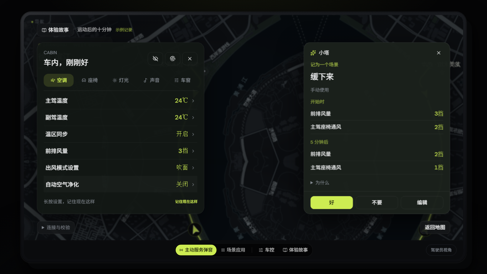
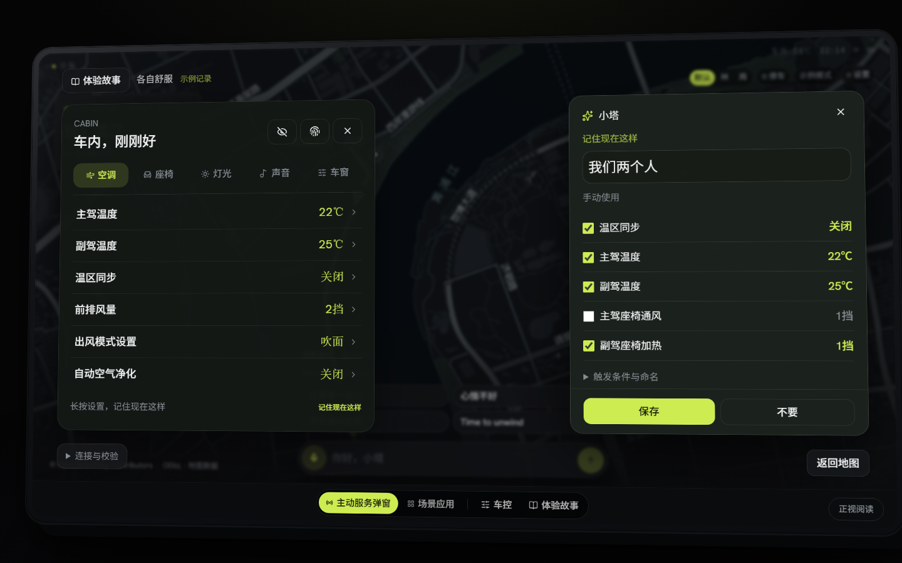

# v21 · 非语音入口与多人故事

保留 Figma Make 的倾斜 1920×1080 显示器、深色柔绿主题、Logo、真实徐汇滨江地图和紧凑卡片。在地图上打开「车控」，或从底部「体验故事」开始。

## 七个故事

| 故事 | 入口 | 可操作的重点 |
| --- | --- | --- |
| 到家后的半首歌 | 观察 | 继续当前音乐，保留屏幕、柔和灯光与主驾声场；手动使用 |
| 运动后的十分钟 | 观察 | 风量 3 挡 / 座椅通风 2 挡，300 秒后降为 2 挡 / 1 挡；间隔、各阶段数值可分别编辑 |
| 这阵风，刚刚好 | 长按 | 主驾窗缝、风量、音量，裁剪保存 |
| 后排的临时工作位 | 长按 | 遮阳帘、声音和共享空调；未虚构后排独立温控 |
| 各自舒服 | 长按 | 温区同步关闭、主副驾不同温度与座椅设置 |
| 晨间暖舱 | 观察 / 基础 | 工作日、清晨、P 挡；主动启用自动使用后体验下一次出行 |
| 等人时这样 | 长按 / 基础 | 最近十分钟的修改，去掉临时除雾，更早的座椅设置默认不选 |

商务与家庭故事直接说明演示中的座位和偏好，不自动识别身份。地点、运动状态和“到家”仅作背景，不生成虚构触发条件。

## 操作闭环

- 调节空调、座椅、灯光、声音、车窗与遮阳帘，数值来自 114 条能力注册表。长按名称或数值约一秒，选择「记住现在这样」；菜单和面板底部也提供入口。
- 快存默认选择当前档案最近十分钟内最终提交、仍不同于默认值的手动设置。滑杆的中间值不记录，恢复默认的项不进入清单，更早的设置折叠且不选。至少留一项，可以改名和改单项值。
- 观察提示直接展开完整方案，提供「好 / 不要 / 编辑 / X」。「好」保存习惯，当前已调好的设置不会再次执行。
- 保存与另存留在原处，之后可「现在使用 / 编辑」。应用立即显示结果；撤销取消后续阶段并恢复快照。关闭应用卡后仍可从浮层撤销。
- 行驶中快存只写入「场景建议」草稿；停车后可重新打开整理。原有语音建议和直接车控继续使用。
- 「我的场景」支持编辑、删除、手动使用与自动使用开关。「它学会了什么」补充习惯来源、最近使用、编辑、停止建议和删除，原有偏好编辑保留。

“晨间暖舱”保存时勾选自动使用，点击「下一次出行」即可验证条件触发。打开「连接与校验 → 检查当前条件」，可验证持续满足不会重复执行。关闭自动使用、删除场景、P 挡条件不满足均不会触发。旧场景不会在升级后自动启用。

## 判断与执行

观察使用预设样本：重复至少 3 次、一致率至少 70%、14 天内、验证 1–7 天、重合率至少 70%；同时检查负面偏好、当前负荷、学习开关、本趟隐私、拒绝冷却、额度及重复候选。保存习惯按独立控制对象与阶段价值检查，当前值已经相同也能保存。快存是用户主动行为，不走主动建议价值门槛。

为便于连续体验不同故事，切换故事推进示例日期 40 天；同一故事连续重播不推进。日期可在「连接与校验」查看，重置示例额度须明确点击；不会删除已经保存的场景或用户偏好。关闭学习、删除证据和“这趟别记”会阻止观察建议。本轮没有实现长期自动挖掘。

动作保持附录 C 的有序数组和「延时」，没有建立另一套场景格式。两套校验器允许跨阶段改变同一设备，同阶段仍检查重复；非法延时不能成为阶段分隔符。执行到下一阶段前重新检查车况、能力和偏好。用户手动接管只取消该设备的剩余调整；撤销取消全部剩余阶段并保留手动新值。调度器仅在内存中活动，刷新不补执行。

默认分阶段间隔是真实 300 秒，卡片上的「5 分钟后」只用于章节跳转，编辑间隔后仍按实际值调度。规划/提议能力不能进入有效执行。

## 连接与存储

- 新增 `POST /api/nonvoice`。观察使用现有 `source: observation` 和结构化候选，AI 补命名、理解；动作、条件或逻辑被改动就拒绝结果。快存可完全离线，AI 命名是可选项。晚到结果不能覆盖编辑或另一故事。
- 扩展 `POST /api/runtime` 的 `trigger`、`manual`，产品确认传 `trial: false`。真实阶段执行、手动接管与撤销均经过同源代理，token 留在服务端。
- 保留当前冻结 p13 及已接入技术结构。启用独立 Runtime 时使用其配置的模板和版本，本轮没有更换模板、做模型选型或继承其他报告的质量得分。
- `scene-studio.saved.v1` / `scene-studio.ideas.v1` 兼容原数据。新增可选 `origin`：入口、故事、证据、自动使用和最近使用/触发；`source: example | live` 保持独立。学习状态按档案存入 `scene-studio.nonvoice.v1`。
- 公共部署使用预设故事与本地确定性车辆模拟。真实观察 AI 需要可访问的独立 Runtime、`PART1_RUNTIME_URL` 和 `PART1_RUNTIME_TOKEN`；独立快存 AI 命名需要服务端 `DEEPSEEK_API_KEY`。未配置返回明确连接错误，不伪装为 AI 回答。

## 验证

- `npm test`：74 项通过，包括七个故事的能力值、证据门控、跨阶段重复、迟到阶段、逐项接管、条件边沿与旧语音逻辑。
- `npm run test:ui`：41 项通过，包括七个故事保存、裁剪、档案、行驶草稿、刷新、AI 迟到/断网与原界面回归。
- `npm run test:runtime`：启动实际 Python HTTP 服务，使用明确的 `offline_fixture` 验证观察命名、保存不执行、分阶段、手动接管、撤销、条件触发、禁用、非法动作及来源检查。此测试不是一次真实模型调用。
- 对应 Runtime 的 Python 回归：36 项通过。
- 匹配的运行时提交：[21932f6](https://github.com/hadan8977/cockpit-scene-orchestration/commit/21932f6)，[浏览器检查记录](previews/v21/checks.json)。
- `npm run typecheck`、生产构建通过。新增文件 lint 通过；全库 lint 的存量诊断与 v20 基线比较未新增，本轮另修复了原焦点工具的 ref 诊断。完整旧库 lint 尚未清零。
- Chromium 检查 1920×1080、1440×900、1366×768 的倾斜/正视画面，常规阶段卡片无需滚动，家庭保存、长按/拖动隔离、刷新和自动使用可操作。外框使用 `overflow: clip` 并禁止焦点自动滚动，防止快速切换时整块显示器偏移。

浏览器检查：先 `npx playwright install chromium`，启动开发服务器，再执行 `npm run test:browser`；`DEMO_URL` 默认 `http://localhost:3005`，截图及检查记录在忽略提交的 `test-results/nonvoice/`。

运行时联调需要设置 `PART1_RUNTIME_DIR`（匹配版本的 `part1-generation-framework/runtime`）与可选 `PART1_PYTHON`，再执行 `npm run test:runtime`。测试创建专用临时模拟数据，不连接车辆或真实模型。

真实 AI 新入口的在线端到端验收仍待有效服务配置，不能用这些通过的模拟测试代替。

## 备份

- 产品基线：`1b02954611d1031cb49806ce9270e2e8b74a44f6`，标签 [`backup/v20-1b02954`](https://github.com/hadan8977/scene-studio-demo/tree/backup/v20-1b02954)。本地源码归档 `backups/scene-studio-v20-1b02954/source.zip`，归档不包含环境文件和密钥。
- Runtime 基线：`e0e2c1b`，标签 `backup/product-nonvoice-e0e2c1b`，本地源码归档 `backups/part1-runtime-e0e2c1b/runtime-source.zip`。
- 上版部署记录在本地备份 manifest；公开主地址继续为 https://scene-studio-demo.vercel.app。
